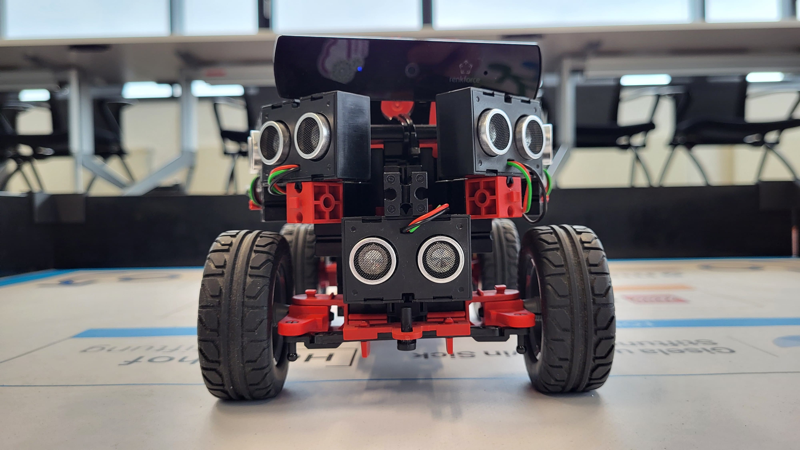

# Documentation of Team 1, Bosch Feuerbach

---

## Members und deren Rollen:
|Name|Rolle|
|-|-|
|Robin Kaiser (PEA6-Fe-Fi)|Entwicklung und Bau|
|Jonathan Zimmer (PEA6-Fe-Fi)|Entwicklung|
|Erik Reichelt (PEA2-Fe-EGS2)|Bau|

---

## Teile und deren Funktion
| Teil Name | Funktion |
| -         | -        |
| Ultraschall-Sensor | Abstand zwischen Wand/Hindenissen und dem Roboter messen |
| Servo | Lenkung |
| Encoder Motor | Antrieb der Hinterachse (mit Differentialgetriebe) |
| TXT 4.0 Controller | Steuerung des Roboters |
| Batterie (8,4v) | Stromversorgung des Roboters und seiner Bestandteile |

---

Weitere Information zu genauer Funktion und Integration [hier](#energie--sensoren) und [hier](#motorisierung)

---

### Motorisierung
Die Motorisierung des Roboters besteht aus zwei Bestandteilen:
1. Encoder Motor (Fischertechnik): Dieser wird zum Antrieb eines Differentialgetriebes genutzt was wierderum die Hinterachse(n) antreibt.
2. Servo: Dieser wird zum Lenken des Roboters verwendet.

---

### Energie & Sensoren
Für die Stromversorgung wird ein 8,4V 1800mAh Fischertechnik Akku verwendet. Es werden insgesamt 6 Ultraschallsensoren und eine Kamera verwendet. Die Ultraschallsensoren messen die Abstände zur nächsten Wand, mit der Kamera soll eine Farberkennung durchgeführt werden.

---

### Hindernisse
Die Farbe der Hindernisse wird von der Kamera erkannt und ausgewertet, dementsprechend lenkt der Roboter ein. Die Ultraschallsensoren überprüfen parallel ob der Roboter dem Hinderniss zu nah kommt.

---

### Engineering und Design
Am Anfang war das Design recht nah am originalen Fischertechnik Bausatz. Es trat das Problem auf, dass der Roboter in einem 45° Winkel an einer Wand stehen blieb. Um dieses Problem zu lösen wurden Vorne Rechts und Vorne Links zwei weitere Ultraschallsensoren schräg angebracht. Ein weiteres Problem war die niedrige Auflösung der Standard Kamera, als Lösung wurde eine neue hochauflösende Webcam montiert. Der Roboter ist schon lang nicht mehr nah am originalen Bausatz, da dieser das Problem hatte, dass er an einigen stellen nicht stabil genug gebaut war. Das hat zum einen die gesammte Struktur betroffen, welche sich durch das Eigengewicht nach unten durchgebogen hat, als auch das "Bauteil" rund um das Differentialgetriebe, welches sich von einer Fahrt zur nächsten immer weiter auseinander zog/drückte, so dass nach ein paar Fahrten, der Roboter schon schwierigkeiten hatte überhapt vom vorwärtsfahren ins rückwärts fahren, über zu gehen.

---

### Bilder:
 
 
 
 
 
 

